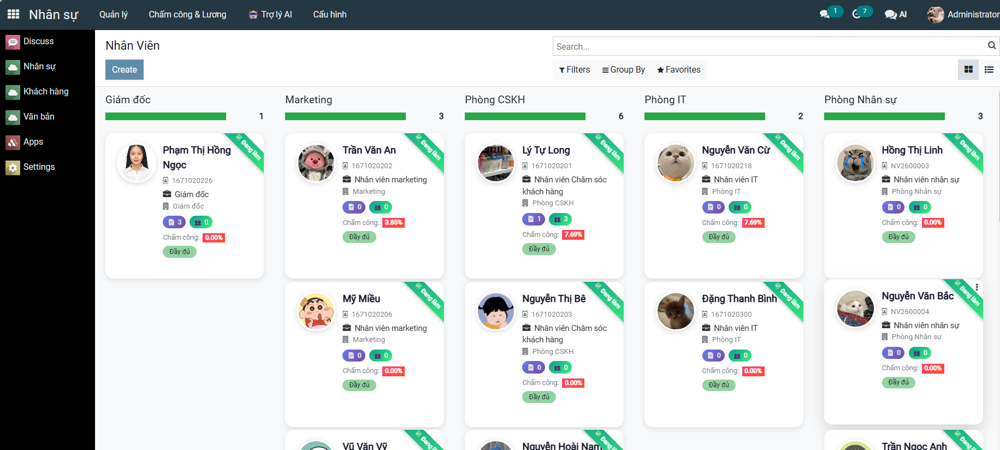
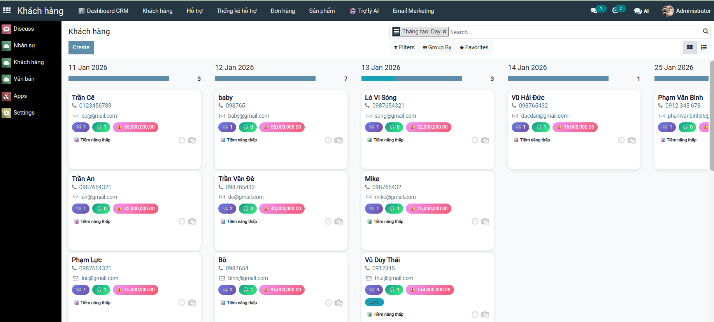
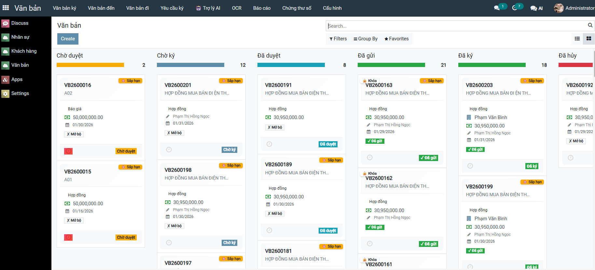
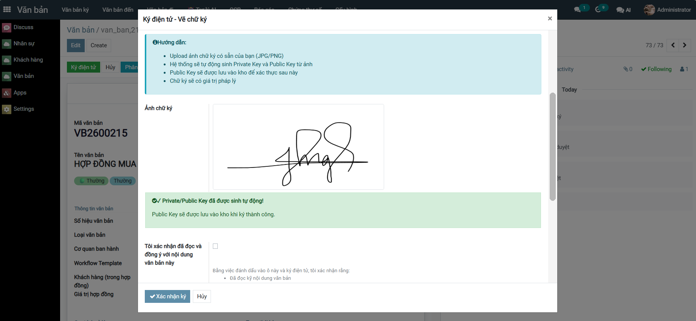
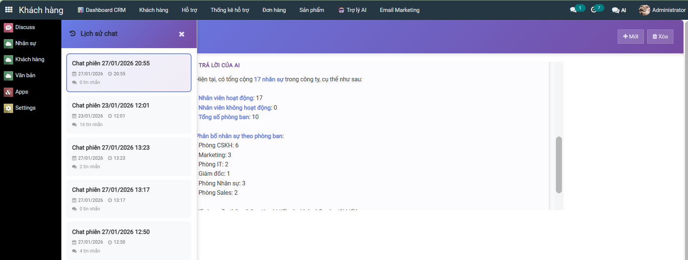
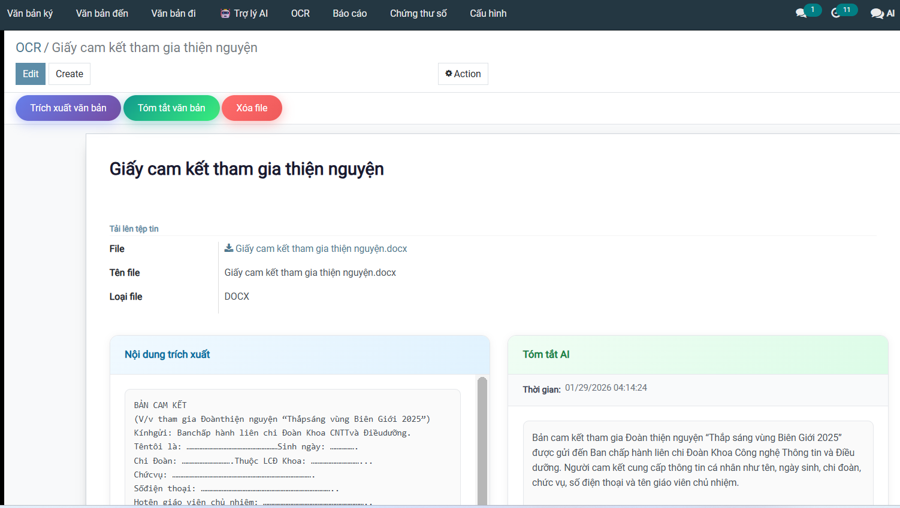
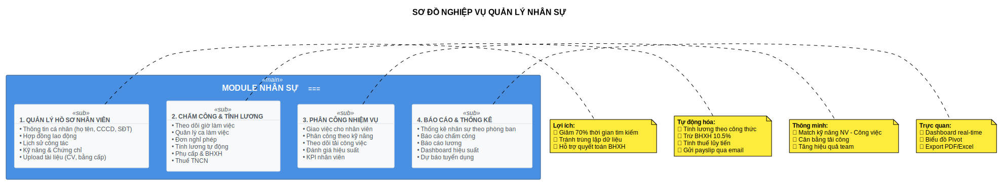
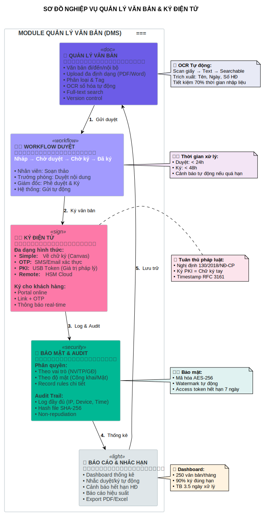

<h2 align="center">
    <a href="https://dainam.edu.vn/vi/khoa-cong-nghe-thong-tin">
    🎓 Khoa Công nghệ Thông tin - Trường Đại học Đại Nam
    </a>
</h2>

<h2 align="center">
   PLATFORM ERP
</h2>

<div align="center">
    <p align="center">
        
        
        
    </p>

[](https://www.facebook.com/DNUAIoTLab)
[](https://dainam.edu.vn/vi/khoa-cong-nghe-thong-tin)
[](https://dainam.edu.vn)


</div>

<h1 align="center">HỆ THỐNG QUẢN LÝ DOANH NGHIỆP ERP</h1>


## 1. Giới thiệu

**Platform ERP** là hệ thống quản lý doanh nghiệp tổng hợp được xây dựng trên nền tảng Odoo 15.0, tích hợp các module quản lý nhân sự, khách hàng, văn bản và trợ lý AI thông minh. Hệ thống được phát triển bởi sinh viên Khoa Công nghệ Thông tin - Trường Đại học Đại Nam.

### ✨ Tính năng nổi bật

- 👥 **Quản lý Nhân sự**: Quản lý thông tin nhân viên, chấm công, lương, nghỉ phép
- 🤝 **Quản lý Khách hàng**: CRM, theo dõi khách hàng, phân khúc thị trường
- 📄 **Quản lý Văn bản**: Quản lý văn bản đến/đi, quy trình phê duyệt, chữ ký số
- 🤖 **Trợ lý AI**: Hỗ trợ tra cứu thông tin thông minh, chatbot tích hợp

---

## 2. Kiến trúc hệ thống

<p align="center">
    
</p>

### 2.1. Quản lý Nhân sự

#### 🎯 Vai trò
Module Quản lý Nhân sự đóng vai trò trung tâm trong việc quản lý toàn bộ thông tin và hoạt động liên quan đến nhân viên trong doanh nghiệp.

#### ⚙️ Chức năng
| Chức năng | Mô tả |
|-----------|-------|
| Quản lý nhân viên | Thêm, sửa, xóa thông tin nhân viên, phân bổ phòng ban |
| Chấm công | Theo dõi giờ làm việc, check-in/check-out |
| Tính lương | Tính toán lương, phụ cấp, khấu trừ tự động |
| Nghỉ phép | Tạo đơn nghỉ phép, quy trình phê duyệt, theo dõi số phép còn lại |
| Báo cáo | Thống kê nhân sự, báo cáo chấm công, lương |

### 2.2. Quản lý Khách hàng

#### 🎯 Vai trò
Module CRM giúp doanh nghiệp quản lý quan hệ khách hàng, theo dõi cơ hội kinh doanh và tối ưu hóa quy trình bán hàng.

#### ⚙️ Chức năng
| Chức năng | Mô tả |
|-----------|-------|
| Quản lý khách hàng | Lưu trữ thông tin khách hàng, lịch sử giao dịch |
| Phân khúc khách hàng | Phân loại khách hàng theo tiêu chí |
| Theo dõi cơ hội | Quản lý pipeline bán hàng |
| Tương tác | Ghi nhận các hoạt động liên lạc với khách hàng |
| Báo cáo | Thống kê doanh số, hiệu quả bán hàng |

### 2.3. Quản lý Văn bản

#### 🎯 Vai trò
Module Quản lý Văn bản số hóa quy trình xử lý văn bản, đảm bảo tính minh bạch và hiệu quả trong công tác hành chính.

#### ⚙️ Chức năng
| Chức năng | Mô tả |
|-----------|-------|
| Văn bản đến | Tiếp nhận, phân loại, chuyển xử lý văn bản đến |
| Văn bản đi | Soạn thảo, trình ký, phát hành văn bản đi |
| Quy trình phê duyệt | Workflow duyệt văn bản nhiều cấp |
| Chữ ký số | Ký số văn bản điện tử |
| Lưu trữ | Lưu trữ, tra cứu văn bản theo tiêu chí |

---

## 3. Giao diện

### 3.1. Quản lý Nhân sự


<p align="center">
    
    <br><em>Giao diện quản lý nhân sự</em>
</p>


### 3.2. Quản lý Khách hàng

<p align="center">
    
    <br><em>Giao diện quản lý khách hàng</em>
</p>

### 3.3. Quản lý Văn bản

<p align="center">
    
    <br><em>Giao diện quản lý văn bản</em>
</p>

### 3.4. Chữ ký số

<p align="center">
    
    <br><em>Giao diện ký số văn bản</em>
</p>

### 3.5. Trợ lý AI

<p align="center">
    
    <br><em>Giao diện Trợ lý AI thông minh</em>
</p>

### 3.6. OCR Văn bản

<p align="center">
    
    <br><em>Giao diện OCR Văn bản</em>
</p>

## 4. Sơ đồ nghiệp vụ

### 4.1. Quản lý Nhân sự


<p align="center">
    
    <br><em>Quy trình nghiệp vụ Quản lý nhân sự</em>
</p>

### 4.2. Quản lý Khách hàng


<p align="center">
    
    <br><em>Quy trình quản lý khách hàng</em>
</p>

### 4.3. Quản lý Văn bản


<p align="center">
    
    <br><em>Quy trình xử lý văn bản</em>
</p>

---

## 5. Hướng dẫn cài đặt

### 5.1. Yêu cầu hệ thống

- **Hệ điều hành**: Ubuntu 20.04+ / Windows 10+ / macOS
- **Python**: 3.10+
- **PostgreSQL**: 13+
- **RAM**: Tối thiểu 4GB
- **Ổ cứng**: Tối thiểu 10GB trống

### 5.2. Clone project

```bash
git clone https://gitlab.com/anhlta/odoo-fitdnu.git
cd odoo-fitdnu
```

### 5.3. Cài đặt thư viện hệ thống

```bash
sudo apt-get update
sudo apt-get install -y \
    libxml2-dev libxslt-dev libldap2-dev libsasl2-dev \
    libssl-dev python3.10-distutils python3.10-dev \
    build-essential libffi-dev zlib1g-dev \
    python3.10-venv libpq-dev
```

### 5.4. Khởi tạo môi trường ảo

```bash
python3.10 -m venv ./venv
source venv/bin/activate
pip3 install -r requirements.txt
```

### 5.5. Khởi tạo Database

```bash
docker-compose up -d
```

### 5.6. Cấu hình Odoo

Tạo file `odoo.conf` từ template:

```bash
cp odoo.conf.template odoo.conf
```

Nội dung file `odoo.conf`:

```ini
[options]
addons_path = addons
db_host = localhost
db_password = odoo
db_user = odoo
db_port = 5432
db_name = ngoc
xmlrpc_port = 8069
```

### 5.7. Chạy hệ thống

```bash
python3 odoo-bin -c odoo.conf
```

Truy cập hệ thống tại: **http://localhost:8069**

---

## 6. Hướng dẫn sử dụng

### 6.1. Đăng nhập hệ thống

1. Truy cập **http://localhost:8069**
2. Nhập thông tin đăng nhập (admin/admin cho lần đầu)
3. Chọn module cần sử dụng từ menu Apps

### 6.2. Quản lý Nhân sự

1. Vào menu **Nhân sự** → **Nhân Viên** để xem danh sách nhân viên
2. Click **Create** để thêm nhân viên mới
3. Vào **Nghỉ phép** để quản lý đơn nghỉ phép
4. Vào **Chấm công & Lương** để theo dõi công và tính lương

### 6.3. Quản lý Khách hàng

1. Vào menu **Khách hàng** để xem danh sách khách hàng
2. Click **Create** để thêm khách hàng mới
3. Sử dụng các filter để phân loại khách hàng

### 6.4. Quản lý Văn bản

1. Vào menu **Văn bản** để xem danh sách văn bản
2. Click **Create** để tạo văn bản mới
3. Sử dụng workflow để trình ký và phê duyệt văn bản

### 6.5. Trợ lý AI

1. Click vào icon **AI** trên thanh menu
2. Nhập câu hỏi hoặc yêu cầu
3. AI sẽ hỗ trợ tra cứu thông tin từ hệ thống

---

## 7. Poster

<p align="center">
  <a href="assets/Poster.png">
    
  </a>
  <br><em>Poster giới thiệu hệ thống Platform ERP</em>
</p>

## 8. Liên hệ

### 👩‍💻 Thông tin tác giả

| Thông tin | Chi tiết |
|-----------|----------|
| **Họ và tên** | Phạm Thị Hồng Ngọc |
| **Số điện thoại** | 0395888778 |
| **Email** | phamnogc887@gmail.com |
